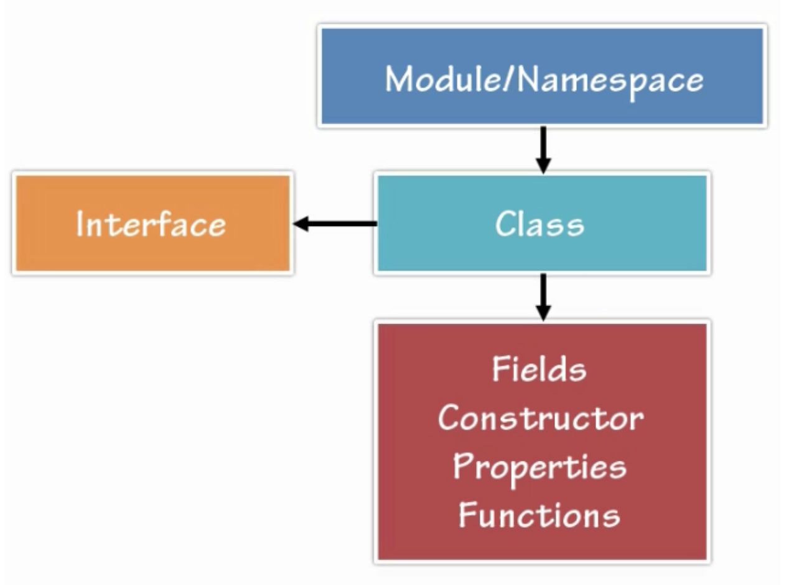

# Typescript

<!-- toc -->

+ [Why Use Typescript?](#why-use-typescript)
+ [Flexible Options](#flexible-options)
+ [Syntax, Keywords and Operators](#syntax-keywords-and-operators)
+ [Code Hierarchy](#code-hierarchy)
+ [Compiler](#compiler)
+ [Tooling/Framework Options](#toolingframework-options)

<!-- tocstop -->

##  Why Use Typescript?

- JavaScript can feel messy! See “Structuring JavaScript Code” on Pluralsight
- We want maintainable code
- Using patterns to create better code
- JavaScript is dynamically typed
  - Variables can hold any object
  - Types determined on the fly
  - Implicit type coercion (conversion)
  - Difficult to ensure proper types are passed without tests
  - Not all developers use ===
  - Enterprise-scale apps can have 1000s of lines of code to maintain

## Flexible Options

- Any Browser
- Any Host
- Any Host
- Open Source
- Tool Support

## Syntax, Keywords and Operators

| Keyword          | Description                                            |
| ---------------- | ------------------------------------------------------ |
| class            | Container for members such as properties and functions |
| constructor      | provides initialization functionality in a class       |
| exports          | export a member from a module                          |
| extends          | extend a class or interface                            |
| implements       | implement an interface                                 |
| imports          | import a module                                        |
| interface        | defines code contract that can be implemented by types |
| module/namespace | container for classes and other code                   |
| public/private   | member visibility modifiers                            |
| ...              | rest parameter syntax                                  |
| =>               | arrow syntax used with definitions and functions       |
| &lt;typeName&gt; | &lt; &gt; characters use to cast/convert between types |
| :                | Separator between variable names and types             |

## Code Hierarchy

- Module - Naming Container
- Interface - Drive consistency across multiple modules

## Compiler

    tsc first.ts

Outputs javascript from typescript file.

    npm install -g typescript

In order to build a project/directory

    tsc -p tsconfig.json

## Tooling/Framework Options

Much easier to catch issues up front.

Playground:
https://www.typescriptlang.org/play/index.html
